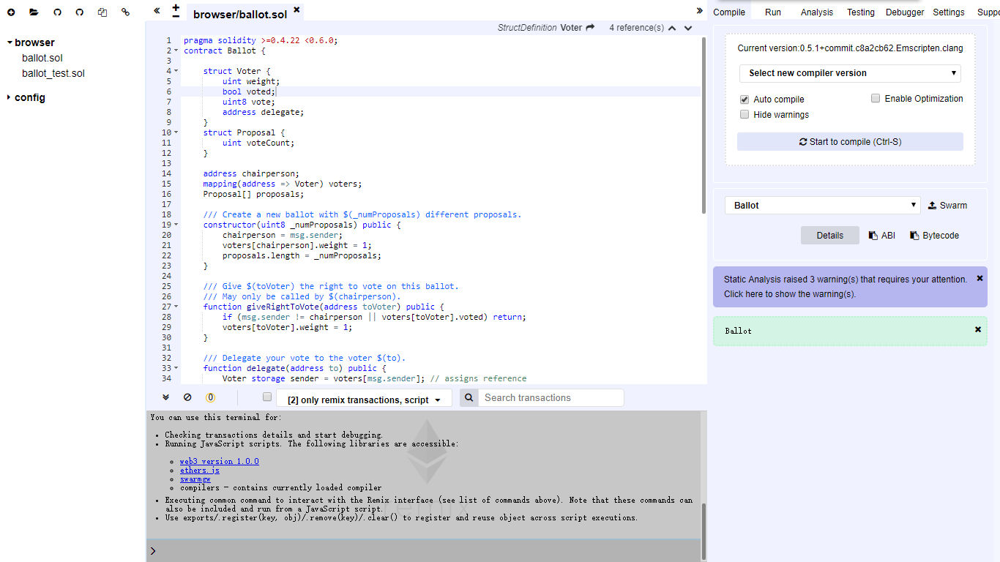
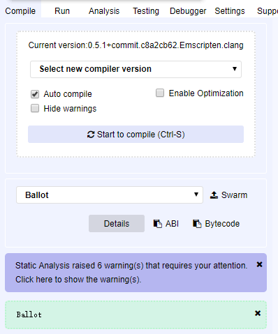
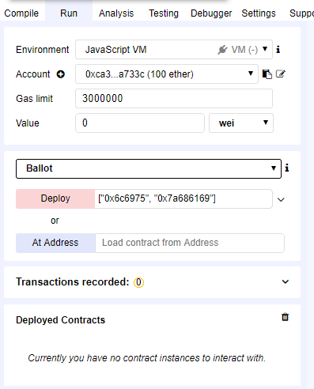
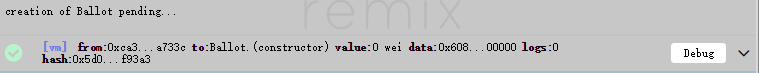
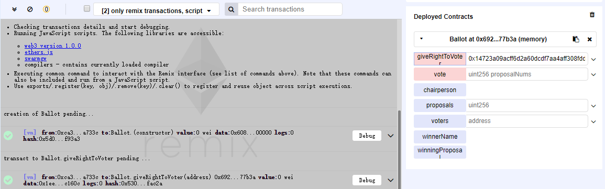
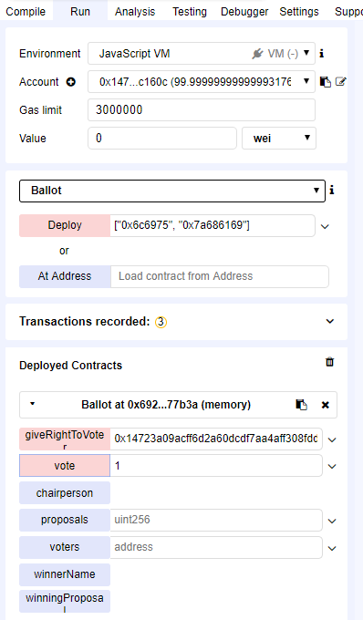
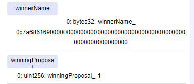

这里主要介绍如何使用Remix编译部署和测试[Ballot](../contract/ballot.sol)合约

### 环境

使用浏览器版的[Remix](<https://remix.ethereum.org/#optimize=false&version=soljson-v0.5.1+commit.c8a2cb62.js>)，打开时自带Ballo合约及其测试合约，不过这里的是官方的委托投票合约。



### 编译

将原有的两个合约文件删除，点击左上角第二个按钮`Add Local file to the Browser Storage Explore`，导入合约文件`ballot.sol`


若右侧`Compile`选项卡勾选了`Auto compile`，则合约自动编译完成，否则手动点击`Start to compile`。



### 测试

切换到`Run`选项卡，`Environment`选择`JavaScript VM`，账户默认，为方便测试，将账户下拉菜单中的第二个账户地址保存

```
0x14723a09acff6d2a60dcdf7aa4aff308fddc160c
```

在`Deploy`后的参数框输入

```
["0x6c6975", "0x7a686169"]
```

*注：”0x6c6975“, "0x7a686169"分别为字符串"liu"和”zhai“的十六进制形式*



点击`Deploy`按钮，代码下面命令行会显示执行成功的回执



`Run`选项卡下`Deployed Contracts`一栏会显示合约详情，由于部署时提案列表已初始化，现将上面保存的第二个账户地址填入`giveRightToVoter`函数参数栏，点击函数名执行，即授予该账户地址投票权成功。同样可在命令行看到成功执行的回执。



将`Account`切换到第二个账户`0x14723a09acff6d2a60dcdf7aa4aff308fddc160c`，在`vote`函数参数栏填入要投的提案编号`1`，即投给`zhai`提案，点击函数名运行。



从命令行得到投票成功的回执后，点击`winningProposal`进行票数统计，点击`winnerName`获取获胜的提案名。



可看到获胜提案为`0x7a686169`，即`zhai`。至此测试完毕，合约运行正常。:smile:

### Errors

#### invalid bytes32 value

`deploy`参数栏输入`["liu", "zhai"]`，部署时出现error

```
creation of Ballot errored: Error encoding arguments: Error: invalid bytes32 value (arg="", type="string", value="liu")
```

remix的issue中开发团队回答为

```
The new abi coder expect to have hex encoder string for bytes32 (like 0xabcd) .. we will try to figure out a way to be more flexible
```

即输入参数需要将字符串转换为16进制，可以使用[str转hex在线工具](<https://tool.lu/hexstr/>)

#### Unexpected token

`deploy`参数栏输入`['0x6c6975']`，部署时出现error

```
creation of Ballot errored: Error encoding arguments: SyntaxError: Unexpected token ' in JSON at position 2
```

这是因为参数需要用双引号包含，不能用单引号。